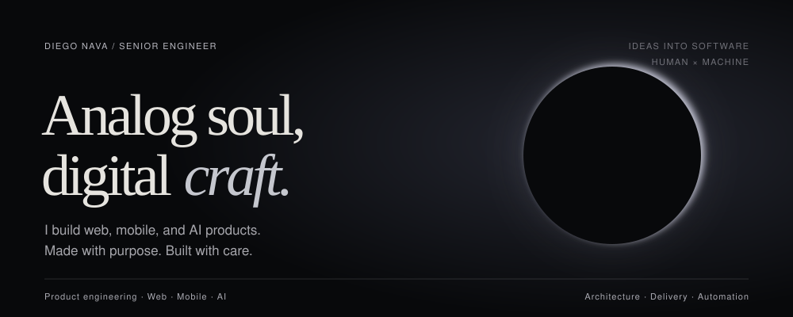
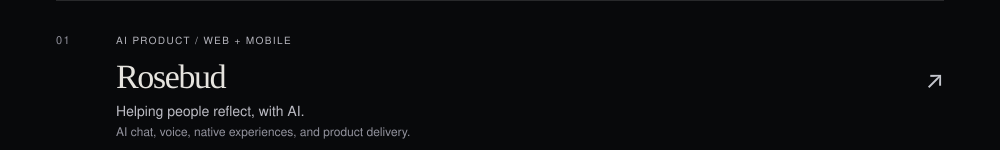
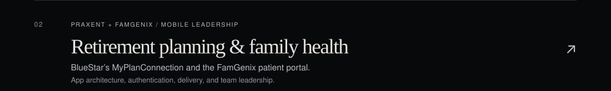
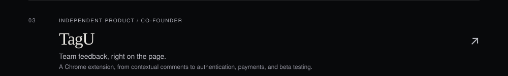
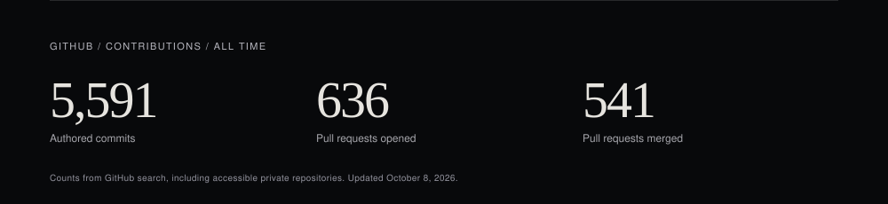
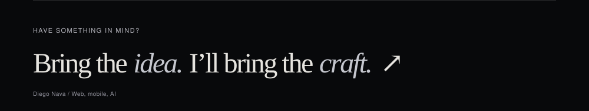

  
  
  
  
  
  
  

  <a href="https://diego-nava.com/">Website</a> ·
  <a href="https://diego-nava.com/resume">Resume</a> ·
  <a href="https://www.linkedin.com/in/diego6nava/">LinkedIn</a> ·
  <a href="mailto:diegomorenonava@gmail.com">Email</a>

